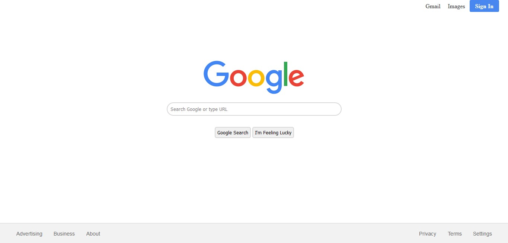

# Google-Homepage
This is an easy project based on the bsics of HTML, CSS and JavaScript. Our goal is to make a copy of the Google Homepage. Be sure to clear the basics of the mentioned topics before starting. Our final webpage will look like this.

All the resources required to complete this project are provided in this repository. With no changes, the code will work just fine. You yourself can update the code as to suit your requirements.
